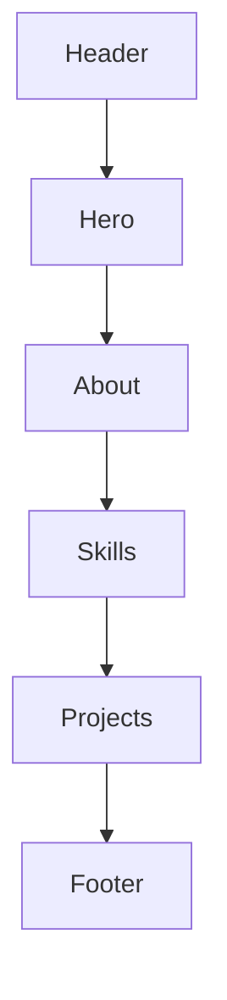

# ワイヤーフレーム

```mermaid
flowchart TB

    Header["Header"]
    Hero["Hero"]
    About["About"]
    Skills["Skills"]
    Projects["Projects"]
    Footer["Footer"]
    Header --> Hero
    Hero --> About
    About --> Skills
    Skills --> Projects
    Projects --> Footer
```